# Hướng dẫn sử dụng Anki cho việc học ngoại ngữ

Anki là một phần mềm giúp bạn ghi nhớ được mọi thứ bằng các thẻ ghi nhớ (flashcards) thông qua gợi nhớ chủ động (active recall) và lặp lại ngắt quãng (spaced repetition), thường được sử dụng bởi người học ngoại ngữ để ghi nhớ từ vựng, cấu trúc ngữ pháp, hán tự (nếu bạn học Tiếng Trung hoặc Tiếng Nhật) hay bởi những bạn học bên Y (Cần phải ghi nhớ rất nhiều thông tin).

> *T cũng học bằng Anki được gần 2 năm, t thì mới tốt nghiệp YHN, thực sự Anki giúp t rất nhiều trong việc ôn thi. Cộng đồng học Y sử dụng Anki trên thế giới đông khủng khiếp. Vấn đề ko nằm ở cách sử dụng, hay các add-on; t thấy hãy quên nó đi, quan trọng là cách bạn đặt câu hỏi và câu trả lời; quan trọng hơn nữa là cách bạn review lại kiến thức. Khi t review lại bài, t luôn luôn cầm theo quyển vở nháp, và viết đáp án ra giấy (hoặc câu nào dễ quá thì cũng phải nói ra mồm); thay vì bấm hiện đáp án ngay, hãy cố gắng recall lại kiến thức trong đầu và viết nó ra.* 
> 
> (Trích từ [một bình luận trên bài viết Tròn 1 năm sử dụng Anki Flashcards để nhớ mọi thứ và một số ghi chú](https://spiderum.com/bai-dang/Tron-1-nam-su-dung-Anki-de-nho-moi-thu-va-mot-so-ghi-chu-8pz))

*Phần mềm này tương đối khó dùng, nhưng rất đáng bỏ thời gian ra học*.

Mình cảm thấy như không ít người học ở nước mình có thói quen tải một bộ thẻ bất kì xịn xịn, dùng vài ngày là lại bỏ. Mình cũng đã từng như vậy, và kể từ khi bắt đầu tìm hiểu chi tiết hơn về cách sử dụng Anki để ghi nhớ thì mình đã dùng được đều đặn được một thời gian dài. Vậy nên, các bộ thẻ được làm sẵn, các addons hay mấy "công cụ AI" sẽ liên tục xuất hiện, nhưng rốt cuộc, cũng chẳng thể giúp bạn ghi nhớ được tốt hơn nếu bạn không hiểu được bạn đang dùng ứng dụng gì.

## Dăm ba cái lý thuyết

Việc hiểu được nguyên lý hoạt động của việc học tập và ghi nhớ trên Anki thực sự rất quan trọng. Rất nhiều người đã từ bỏ sử dụng Anki chỉ sau một thời gian ngắn vì nghĩ rằng đây chỉ là một ứng dụng thẻ ghi nhớ như kiểu Quizlet.

Bạn cũng có thể xem các video về [Học để thi của Duy Thành Nguyễn](https://www.youtube.com/playlist?list=PLCI5VGItTkAtyyUY_DJ3-_L90BUD6Aeg9)

<iframe width="560" height="315" src="https://www.youtube.com/embed/0hJlVqNrnIo?si=6GAp8WM1TVjfAKlE" title="YouTube video player" frameborder="0" allow="accelerometer; autoplay; clipboard-write; encrypted-media; gyroscope; picture-in-picture; web-share" referrerpolicy="strict-origin-when-cross-origin" allowfullscreen></iframe>

### Gợi nhớ chủ động (Active Recall)

<iframe width="560" height="315" src="https://www.youtube.com/embed/gaHK7zJ50BI?si=fV_iW8Ziw39OJHww" title="YouTube video player" frameborder="0" allow="accelerometer; autoplay; clipboard-write; encrypted-media; gyroscope; picture-in-picture; web-share" referrerpolicy="strict-origin-when-cross-origin" allowfullscreen></iframe>

Gợi nhớ chủ động là khi bạn ép mình phải nhớ ra, tìm kiếm thông tin trong đầu thay vì đọc kiến thức từ sách hay ghi chú hay gì đó một cách thụ động.

Mỗi một thẻ ghi nhớ là một cặp câu hỏi và câu trả lời. Để trả lời câu hỏi trong mỗi thẻ ghi nhớ, bạn phải hiểu câu hỏi trước đã. Phải hiểu câu hỏi trước thì bạn mới có thể trả lời được. Việc hiểu được câu hỏi và tìm ra câu trả lời sẽ khiến bạn phải suy nghĩ khá nhiều. Suy nghĩ nhiều thì não mới có nếp nhăn.

### Lặp lại ngắt quãng (Spaced Repetition)

<iframe width="560" height="315" src="https://www.youtube.com/embed/h2AF8Y5AKbo?si=Fk0TBh9OFJQHzZY-" title="YouTube video player" frameborder="0" allow="accelerometer; autoplay; clipboard-write; encrypted-media; gyroscope; picture-in-picture; web-share" referrerpolicy="strict-origin-when-cross-origin" allowfullscreen></iframe>

Trong bài viết về SRS của Antimoon, Tom có viết rằng:

> Ưu điểm cực lớn từ SRS là thay vì mỗi lần ôn lại tất cả từ vựng (như một số các phương pháp truyền thống như ghi chép, chép lại từ mới .v.v), bạn chỉ ôn lại một phần nhỏ trong số đó vì phần mềm lặp lại ngắt quãng biết từ nào bạn nhớ rõ và từ nào bạn nhớ kém nên nó sẽ giúp bạn không lãng phí thời gian vào những điều đã được biết rõ. Chỉ cần ôn lại những điều bạn thực sự cần ôn lại - những thứ có nguy cơ bị quên.
>
> Kết quả khá ấn tượng: Bạn có thể ghi nhớ hàng nghìn từ và cụm từ dù chỉ cần 10 phút mỗi ngày để ôn tập. Nó giống như gắn thêm một ổ cứng vào đầu vậy.

_Trích từ bài viết [Introduction to SRS](https://www.antimoon.com/how/srs-intro.htm) được viết bởi Tom trên Antimoon. [Bản dịch Tiếng Việt của bài viết](srs.md)_

Mô hình bộ nhớ trong phần mềm lặp lại ngắt quãng dựa trên nghiên cứu khoa học về trí nhớ con người. **Ký ức trở nên mạnh mẽ hơn sau mỗi lần ôn lại**. Ví dụ: sau khi bạn học một từ mới, bạn có thể nhớ nó trong 2 ngày (với xác suất là 90%). Nếu bạn xem lại nó sau 2 ngày, bạn sẽ nhớ nó thêm 5 ngày nữa. Nếu bạn xem lại sau 5 ngày đó, bạn sẽ nhớ nó thêm 10 ngày nữa. Sau đó, thêm 20 ngày nữa. Và như thế. Thời gian giữa các lần ôn tập ngày càng dài hơn.

Anki là sự kết hợp của Active Recall (Ôn tập chủ động) và Spaced Repetition (Lặp lại ngắt quãng), giúp xây dựng một quá trình học tập cực kỳ hiệu quả. Đồng thời, giảm đáng kể thời gian bạn cần dành cho việc học và tăng đáng kể lượng kiến thức bạn biết nếu bạn dành cùng một lượng thời gian học như trước khi sử dụng các kỹ thuật này.

> "Mô hình bộ nhớ trong phần mềm lặp lại ngắt quãng dựa trên nghiên cứu khoa học về trí nhớ con người. Ký ức sẽ trở nên mạnh mẽ hơn sau mỗi lần ôn lại [...] Vì thời gian giữa các lần lặp lại dài hơn nên khối lượng công việc của bạn (số lần lặp lại hàng ngày) ngày càng giảm. Bạn sử dụng SRS càng lâu thì càng mất ít thời gian để ghi nhớ một nhóm từ trong bộ nhớ".

## Cách cài đặt và sử dụng ứng dụng Anki

Sau khi đã hiểu về nguyên lý ghi nhớ khoa học (Active Recall và SRS) ở phần trước, trong phần này chúng ta sẽ cùng bắt tay vào thực hành: từ cách cài đặt cho đến việc tạo và ôn tập những bộ thẻ đầu tiên trên Anki.

<iframe width="560" height="315" src="https://www.youtube.com/embed/SBu0BwjGuQ4?si=pUyAY09EdSoyheYu" title="YouTube video player" frameborder="0" allow="accelerometer; autoplay; clipboard-write; encrypted-media; gyroscope; picture-in-picture; web-share" referrerpolicy="strict-origin-when-cross-origin" allowfullscreen></iframe>

Anki là phần mềm học tập thông qua các thẻ ghi nhớ điện tử (Flashcards). Một tập hợp gồm nhiều thẻ flashcard được gọi là một **Bộ thẻ (Deck)**. Bạn có thể tự tạo bộ thẻ cho riêng mình hoặc tải các bộ thẻ có sẵn do cộng đồng chia sẻ. Tuy nhiên, lời khuyên là bạn *nên tự tạo bộ thẻ cho riêng mình*, bởi vì kiến thức tự tay chắt lọc sẽ bám sát đúng trình độ và nhu cầu của bạn nhất, tránh tình trạng bộ thẻ tải về quá dễ hoặc quá khó.

### Cách tải xuống và cài đặt Anki

1. Truy cập vào [trang chủ của Anki](https://apps.ankiweb.net/) và tải về bản cài đặt phù hợp với hệ điều hành của bạn (Windows, macOS, Linux).
2. Mở tệp vừa tải về và tiến hành cài đặt theo hướng dẫn trên màn hình (với Windows, bạn chỉ cần nhấn *Next/Install* cho đến khi hoàn tất).
3. Mở ứng dụng Anki. Trong lần khởi động đầu tiên, phần mềm sẽ yêu cầu chọn ngôn ngữ giao diện: bạn có thể giữ nguyên **English** (khuyên dùng để dễ theo dõi các hướng dẫn quốc tế) hoặc chọn **Vietnamese**.

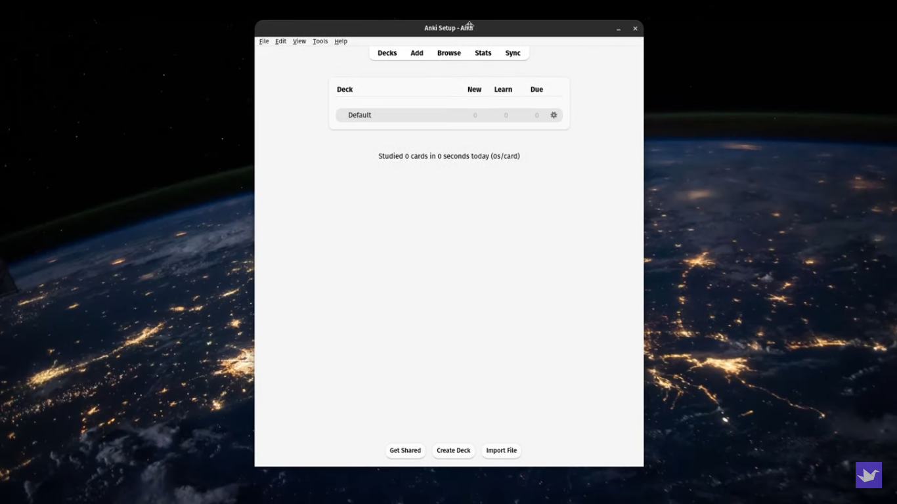

Tại màn hình chính, bạn sẽ thấy 2 nút chức năng quan trọng ở phía dưới:

- Create Deck: Tự tạo một bộ thẻ mới cho riêng bạn.
- Get Shared: Mở kho bộ thẻ chia sẻ từ cộng đồng AnkiWeb để tải về các bộ thẻ làm sẵn.

### 2. Tạo bộ thẻ và tạo thẻ mới

#### Tạo bộ thẻ (Deck)

Nhấp vào nút **Create Deck** ở góc dưới màn hình, nhập tên bộ thẻ bạn muốn tạo (ví dụ: *Tiếng Anh cơ bản*, *Giải phẫu học*) rồi nhấn **OK**.

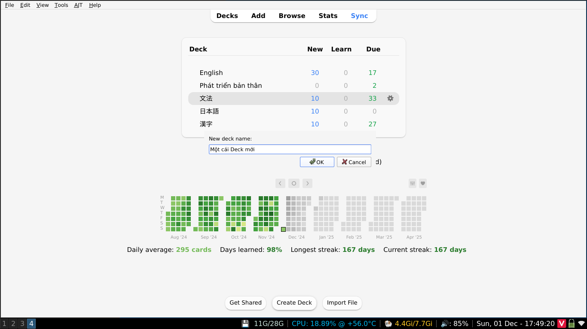

#### Thêm thẻ mới (Add Cards)

Nhấp vào nút **Add** trên thanh công cụ trên cùng để mở cửa sổ tạo thẻ:

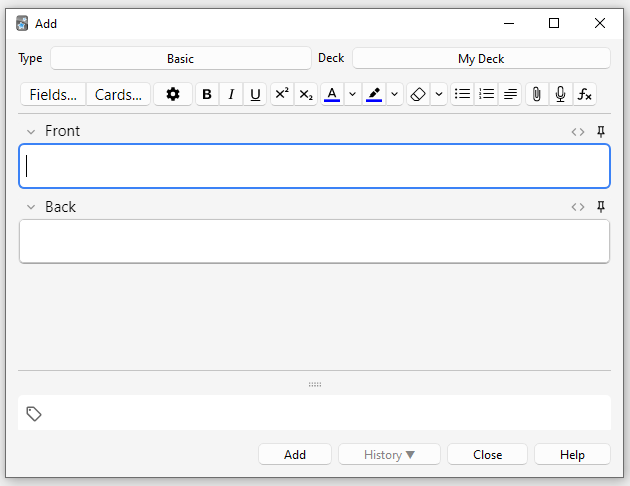

Trong cửa sổ này, bạn chú ý các mục sau:

- **Type (Loại ghi chú):** Mặc định là **Basic** (thẻ cơ bản nhất với 2 mặt). Anki còn nhiều loại thẻ nâng cao khác mà chúng ta sẽ tìm hiểu kỹ ở phần *Key Concepts*.
- **Deck (Bộ thẻ):** Chọn bộ thẻ bạn muốn lưu thẻ này vào.
- **Front (Mặt trước):** Nhập câu hỏi, từ vựng hoặc khái niệm cần ghi nhớ.
- **Back (Mặt sau):** Nhập câu trả lời, định nghĩa hoặc giải thích chi tiết.
- **Tags (Thẻ phân loại):** Thêm nhãn để nhóm các thẻ cùng chủ đề lại với nhau (ví dụ: `danh-tu`, `bai-1`), giúp bạn dễ dàng lọc và quản lý sau này.

Sau khi điền xong thông tin, bạn bấm nút **Add** (hoặc nhấn tổ hợp phím `Ctrl + Enter` trên Windows / `Cmd + Enter` trên Mac) để lưu thẻ. Cửa sổ sẽ tự động làm trống để bạn tiếp tục nhập thẻ tiếp theo.

Thử xem ví dụ về mặt trước (Front) và mặt sau (Back) của một thẻ:

Mặt trước:

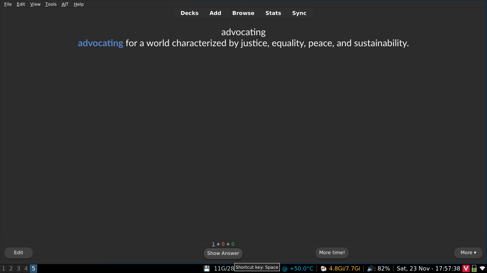

Mặt sau:

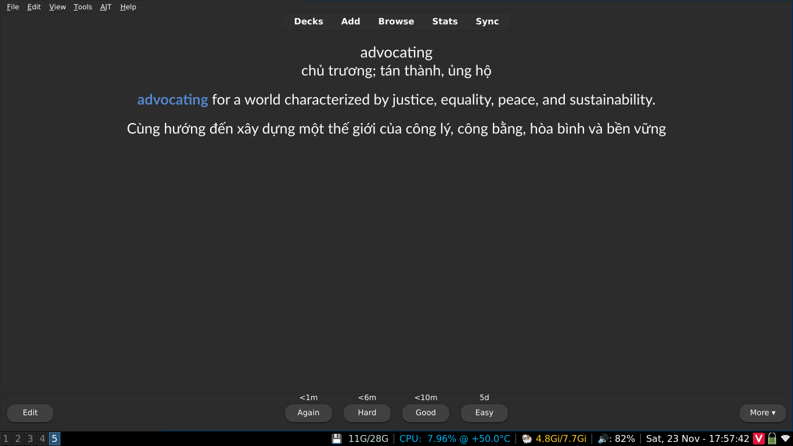

### Quy trình ôn tập trong một phiên học (Session)

Sau khi đã có thẻ trong bộ thẻ, bạn nhấp vào tên bộ thẻ đó và bấm **Study Now** để bắt đầu học.

Một chu trình học chuẩn với Active Recall và SRS diễn ra như sau:

1. **Chủ động gợi nhớ (Active Recall):** Khi mặt trước của thẻ hiện ra, hãy dừng lại vài giây để **tự truy xuất câu trả lời trong đầu** (hoặc nói ra miệng) thay vì vội vàng bấm xem đáp án.
2. **Đối chiếu kết quả:** Bấm nút **Show Answer** (hoặc phím cách `Space`) để lật mở mặt sau.
3. **Đánh giá mức độ ghi nhớ (SRS):** Anki sẽ đưa ra các nút đánh giá tương ứng với thời gian lặp lại:
   - **Again:** Nếu bạn trả lời sai hoặc hoàn toàn không nhớ (thẻ sẽ xuất hiện lại ngay trong vài phút tới).
   - **Hard:** Trả lời đúng nhưng tốn nhiều thời gian suy nghĩ.
   - **Good:** Trả lời đúng với mức độ nỗ lực vừa phải (mức chuẩn khuyên dùng cho người mới).
   - **Easy:** Quá dễ, nhớ ngay lập tức mà không cần suy nghĩ.

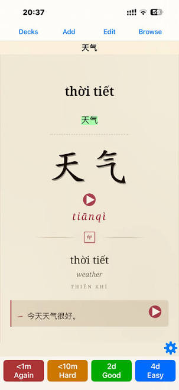

(*ví dụ mặt sau của một thẻ anki ([nguồn](https://www.facebook.com/groups/ankivocabulary/posts/2088898245203155/))*)

> **Mẹo cho người mới:** Để tránh phân vân, bạn chỉ cần dùng 2 nút: **Again** (khi quên/sai) và **Good** (khi nhớ đúng).

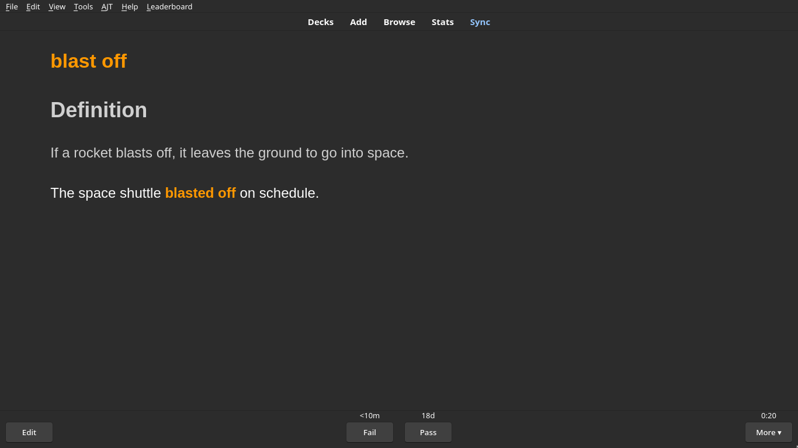

*Sử dụng Addon [PassFail2](https://ankiweb.net/shared/info/876946123) để ẩn đi nút Hard và Easy.*

Bạn tiếp tục ôn tập cho đến khi màn hình hiển thị thông báo *Congratulations! You have finished this deck for now* là hoàn thành phiên học trong ngày.

### Các phím tắt thông dụng khi ôn tập

- `Space` (Phím cách): Mở đáp án / Chọn nhanh nút **Good**.
- `1`, `2`, `3`, `4`: Tương ứng với các nút đánh giá **Again**, **Hard**, **Good**, **Easy**.
- `e`: Chỉnh sửa nhanh nội dung thẻ đang hiển thị (*Edit*).
- `d`: Trở về danh sách bộ thẻ chính (*Decks*).
- `b`: Mở trình duyệt quản lý thẻ (*Browse*).
- `y` (hoặc phím đồng bộ): Đồng bộ dữ liệu lên AnkiWeb (*Sync*).

### Duy trì thói quen học hàng ngày

Thuật toán lặp lại ngắt quãng (SRS) của Anki chỉ thực sự mang lại lợi ích lớn khi bạn *ôn tập đều đặn mỗi ngày**. Nếu bỏ bẵng vài ngày, số lượng thẻ ôn tập dồn lại (backlog) sẽ rất lớn và dễ làm bạn nản lòng. Đây cũng chính là lý do tại sao phần lớn mọi người lại rời bỏ Anki chỉ sau vài ngày sử dụng.

<iframe width="560" height="315" src="https://www.youtube.com/embed/UDUITtA1jJI?si=TtNtGTxd7vUO1GuA" title="YouTube video player" frameborder="0" allow="accelerometer; autoplay; clipboard-write; encrypted-media; gyroscope; picture-in-picture; web-share" referrerpolicy="strict-origin-when-cross-origin" allowfullscreen></iframe>

Hãy đặt mục tiêu học từ 10 - 15 phút mỗi ngày thay vì dồn vào học một lần vào cuối tuần. Một mẹo ngoài lề chút là bạn có thể thử đọc Thói quen nguyên tử của James Clear.

## Những khái niệm về Anki mà bạn nên hiểu

Sau khi bạn đã *nghịch ngợm* và quen tay với Anki, đã đến lúc để hiểu hơn về các khái niệm *cơ bản* trong Anki để có thể giúp bạn sử dụng Anki hiệu quả hơn. 

### Thẻ (Cards)

Một cặp câu hỏi và câu trả lời được gọi là một **thẻ** (_card_). Khái niệm này tương tự như một tấm flashcard bằng giấy với câu hỏi ở mặt trước và câu trả lời ở mặt sau. Tuy nhiên, trong Anki, thẻ không giống hoàn toàn với thẻ giấy vật lý: theo mặc định, khi bạn mở xem câu trả lời, phần câu hỏi vẫn sẽ hiển thị trên màn hình. Ví dụ: nếu đang học hóa học cơ bản, bạn có thể thấy một câu hỏi như sau:

    Q: Ký hiệu hóa học của oxy là gì?

Sau khi xác định câu trả lời là O, bạn bấm vào nút **Show Answer** (Hiển thị đáp án), và Anki sẽ hiển thị:

    Q: Ký hiệu hóa học của oxy là gì?
    A: O

Sau khi đối chiếu và biết mình đã trả lời đúng, bạn sẽ cho Anki biết mức độ ghi nhớ của mình đối với câu hỏi đó. Dựa vào đó, Anki sẽ tự động tính toán thời điểm thích hợp để hiển thị lại thẻ cho bạn ôn tập. Ví dụ: Anki có thể lên lịch hiển thị lại thẻ này sau 3 ngày. Trong trường hợp này, ta nói thẻ hiện có **khoảng giãn cách ôn tập (interval)** là 3 ngày.

#### Các trạng thái của thẻ (Card States)

- **New (Mới):** Những thẻ bạn vừa tải về hoặc tự tạo nhưng chưa từng học lần nào.

- **Learning (Đang học):** Những thẻ bạn mới thấy lần đầu gần đây và vẫn đang trong giai đoạn học ban đầu (chưa hoàn thành chu kỳ học ghi nhớ).

- **Review (Ôn tập):** Những thẻ bạn đã hoàn thành giai đoạn học ban đầu. Các thẻ này sẽ xuất hiện trở lại sau khi hết khoảng thời gian chờ (interval).
  Có 2 loại thẻ ôn tập:
  - **Young (Thẻ non):** Là thẻ có khoảng giãn cách ôn tập dưới 21 ngày.
  - **Mature (Thẻ thuần thục):** Là thẻ có khoảng giãn cách ôn tập từ 21 ngày trở lên.

- **Relearn (Học lại):** Những thẻ bạn đã quên trong giai đoạn ôn tập (Review). Các thẻ này sẽ được đưa trở lại trạng thái học lại để bạn ghi nhớ từ đầu.

### Bộ thẻ (Decks)

Một **bộ thẻ** (_deck_) là một nhóm tập hợp nhiều thẻ lại với nhau. Bạn có thể phân chia các thẻ vào các bộ thẻ khác nhau để học từng phần trong kho kiến thức của mình thay vì phải học tất cả cùng một lúc. Mỗi bộ thẻ có thể cài đặt các thiết lập riêng biệt, chẳng hạn như số lượng thẻ mới xuất hiện mỗi ngày hoặc thời gian chờ trước khi thẻ xuất hiện trở lại.

Các bộ thẻ có thể chứa các bộ thẻ khác bên trong, cho phép bạn sắp xếp chúng theo cấu trúc hình cây (cây thư mục). Anki sử dụng hai dấu hai chấm ("::") để phân tách các cấp độ trong cây bộ thẻ. Ví dụ: một bộ thẻ có tên `"Tiếng Trung::Hán tự"` tức là bộ thẻ con "Hán tự" nằm bên trong bộ thẻ cha "Tiếng Trung". Nếu bạn chọn học bộ "Hán tự", chỉ các thẻ Hán tự mới được hiển thị; còn nếu bạn chọn bộ "Tiếng Trung", tất cả các thẻ trong bộ Tiếng Trung sẽ hiển thị, bao gồm cả các thẻ trong bộ "Hán tự".

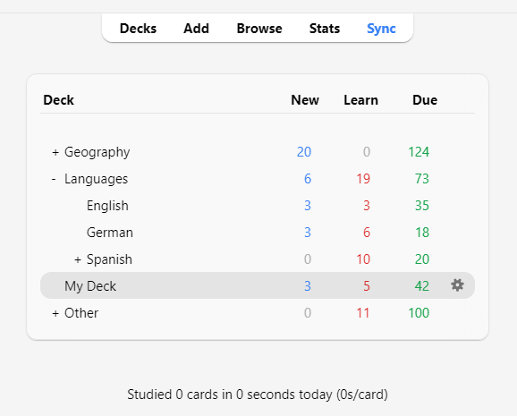

Để tạo cấu trúc cây cho các bộ thẻ, bạn có thể đặt tên cho chúng kèm theo hai dấu hai chấm giữa các cấp, hoặc chỉ cần kéo và thả chúng trực tiếp trong danh sách bộ thẻ. Các bộ thẻ nằm bên trong một bộ thẻ khác thường được gọi là **bộ thẻ con (subdecks)**, còn bộ thẻ ở cấp cao nhất được gọi là **bộ thẻ cha (parent decks)**.

Anki luôn có sẵn một bộ thẻ mặc định tên là "Default"; bất kỳ thẻ nào bị tách rời khỏi bộ thẻ cũ vì lý do nào đó sẽ được tự động chuyển về đây. Anki sẽ tự ẩn bộ thẻ Default này nếu nó không chứa thẻ nào và bạn đã tạo thêm các bộ thẻ khác. Ngoài ra, bạn cũng có thể đổi tên bộ thẻ Default này để chứa các thẻ học khác.

Các bộ thẻ trong danh sách được sắp xếp theo thứ tự bảng chữ cái. Điều này có thể dẫn đến thứ tự hiển thị không như mong muốn nếu tên bộ thẻ có chứa chữ số. Ví dụ: bộ thẻ "Bộ thẻ 10" sẽ đứng trước "Bộ thẻ 9" vì số 1 đứng trước số 9 theo quy tắc chữ cái. Nếu muốn "Bộ thẻ 9" xuất hiện trước, bạn có thể đổi tên thành "Bộ thẻ 09" để nó xếp trước "Bộ thẻ 10".

> **Mẹo:** Bộ thẻ nên được dùng để chứa các danh mục kiến thức lớn (ví dụ: "Tiếng Anh", "Giải phẫu học"), thay vì chia quá chi tiết thành các chủ đề nhỏ như "Động từ về đồ ăn" hay "Bài 1".

### Ghi chú & Trường thông tin (Notes & Fields)

Khi tạo flashcard, chúng ta thường muốn tạo nhiều hơn một thẻ liên quan đến cùng một đơn vị kiến thức. Ví dụ: khi học tiếng Pháp, bạn học từ _bonjour_ có nghĩa là "xin chào". Bạn có thể muốn tạo một thẻ hiển thị "bonjour" và yêu cầu bạn nhớ nghĩa "xin chào", đồng thời tạo thêm một thẻ khác hiển thị "xin chào" và yêu cầu bạn nhớ từ "bonjour". Thẻ thứ nhất kiểm tra **khả năng nhận biết (recognition)** từ tiếng Pháp, còn thẻ thứ hai kiểm tra **khả năng phản xạ/tạo ra (production)** từ đó.

Khi dùng flashcard giấy truyền thống, cách duy nhất trong trường hợp này là bạn phải viết lại thông tin hai lần trên hai tấm thẻ riêng biệt. Một số phần mềm flashcard đơn giản hỗ trợ tính năng đảo mặt trước và mặt sau. Dù tiện hơn thẻ giấy, cách làm này vẫn có 2 nhược điểm lớn:

- Các phần mềm đó không theo dõi riêng biệt mức độ ghi nhớ của bạn giữa việc "nhận biết" và việc "phản xạ", khiến thẻ không được hiển thị vào thời điểm tối ưu: bạn sẽ dễ bị quên hơn hoặc phải học lại nhiều hơn mức cần thiết.
- Việc đảo ngược câu hỏi và câu trả lời chỉ hiệu quả khi bạn muốn nội dung ở hai mặt hoàn toàn giống nhau. Điều này đồng nghĩa với việc bạn không thể thêm các thông tin phụ (như ví dụ, số trang, phát âm) vào riêng mặt sau của từng thẻ.

Anki giải quyết triệt để vấn đề này bằng cách cho phép bạn chia nhỏ nội dung của thẻ thành các mẩu thông tin riêng biệt. Sau đó, bạn chỉ cần chỉ định cho Anki biết mẩu thông tin nào sẽ xuất hiện trên thẻ nào; Anki sẽ tự động tạo thẻ cho bạn và tự động cập nhật tất cả các thẻ liên quan nếu bạn có chỉnh sửa thông tin sau này.

Giả sử chúng ta muốn học từ vựng tiếng Pháp và muốn đính kèm số trang sách giáo khoa ở mặt sau của mỗi thẻ. Chúng ta muốn hai thẻ có dạng như sau:

Thẻ 1:
    Q: Bonjour
    A: Hello
       Page #12

Thẻ 2:
    Q: Hello
    A: Bonjour
       Page #12

Ở cả hai thẻ, chúng ta đều dùng chung 3 mẩu thông tin: một từ tiếng Pháp, một nghĩa tiếng Anh và một số trang sách. Nếu gộp chung lại, chúng sẽ trông như thế này:

    French: Bonjour
    English: Hello
    Page: 12

Trong Anki, tập hợp các thông tin liên quan này được gọi là một **ghi chú (_note_)**, và mỗi mẩu thông tin riêng lẻ được chứa trong một **trường thông tin (_field_)**. Trong ví dụ trên, ghi chú có 3 trường: "French", "English", và "Page".

Để thêm hoặc chỉnh sửa các trường thông tin, hãy nhấp vào nút **Fields...** trong khi thêm hoặc chỉnh sửa ghi chú.

### Loại thẻ (Card Types)

Để Anki có thể tự động tạo thẻ từ các ghi chú của bạn, chúng ta cần cung cấp cho Anki một "bản thiết kế" (blueprint) quy định trường thông tin nào sẽ hiển thị ở mặt trước hoặc mặt sau của mỗi thẻ. Bản thiết kế này được gọi là một **loại thẻ (_card type_)**. Mỗi loại ghi chú có thể có một hoặc nhiều loại thẻ; khi bạn thêm một ghi chú, Anki sẽ tự động tạo ra một thẻ tương ứng cho từng loại thẻ đó.

Tất cả các loại thẻ đều có hai **mẫu thiết kế (_templates_)**: một mẫu cho câu hỏi (mặt trước) và một mẫu cho câu trả lời (mặt sau). Trong ví dụ tiếng Pháp ở trên, chúng ta muốn mặt sau của thẻ nhận biết trông như thế này:

    Q: Bonjour
    A: Hello
       Page #12

Để làm được điều đó, chúng ta có thể thiết lập mẫu mặt sau (Answer template) như sau:

    Q: {{French}}
    A: {{English}} 
       Page #{{Page}}

Trong mẫu thiết kế thẻ, tên các trường thông tin được đặt bên trong dấu ngoặc nhọn kép, ví dụ: `{{French}}` hoặc `{{English}}`. Anki sẽ tự động thay thế các mã này bằng nội dung văn bản thực tế trong từng trường tương ứng. Thao tác này được gọi là "Thay thế trường thông tin" (Field replacement). Những đoạn văn bản không nằm trong ngoặc nhọn kép sẽ xuất hiện cố định giống hệt nhau trên mọi thẻ. Ví dụ: bạn không cần phải tự gõ chữ "Page #" trên mỗi ghi chú vì mẫu thiết kế sẽ tự động thêm chữ đó vào mọi thẻ. Thẻ ` ` là một đoạn mã đặc biệt dùng để bảo Anki xuống dòng mới.

Mẫu thiết kế cho thẻ phản xạ (production card) cũng hoạt động tương tự:

    Q: {{English}}
    A: {{French}} 
       Page #{{Page}}

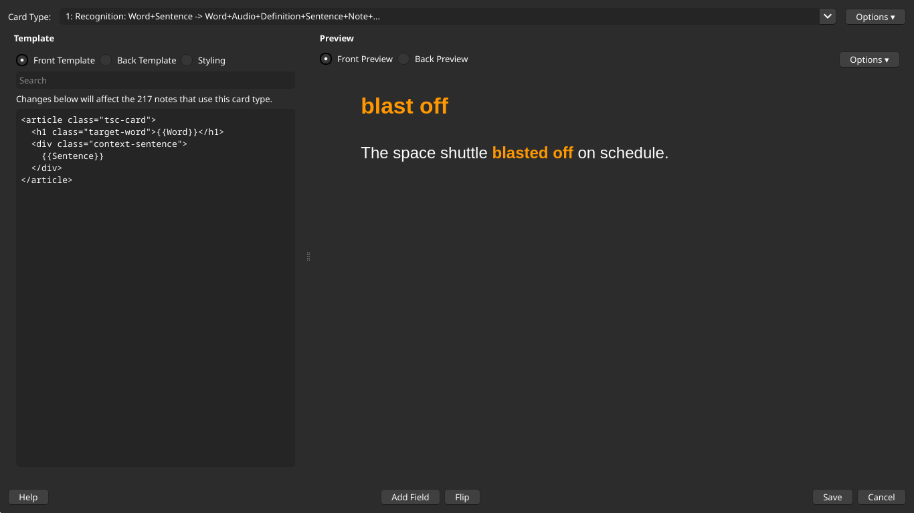

Sau khi một loại thẻ được thiết lập, mỗi lần bạn thêm một ghi chú mới, Anki sẽ tự động tạo thẻ dựa trên loại thẻ đó. Loại thẻ giúp bạn luôn giữ định dạng thẻ đồng nhất và tiết kiệm đáng kể thời gian, công sức khi nhập liệu. Nhờ đó, Anki cũng có thể tự động giãn cách để các thẻ có nội dung liên quan không xuất hiện quá gần nhau trong cùng một buổi học; đồng thời nếu bạn sửa lỗi chính tả hay nội dung ở một ghi chú, tất cả các thẻ liên quan sẽ được tự động cập nhật ngay lập tức.

Để thêm và chỉnh sửa các loại thẻ, hãy nhấp vào nút **Cards...** trong khi thêm hoặc chỉnh sửa ghi chú.

### Loại ghi chú (Note Types)

Anki cho phép bạn tạo nhiều loại ghi chú khác nhau cho từng loại tài liệu học tập. Mỗi loại ghi chú sẽ có bộ trường thông tin (fields) và loại thẻ (card types) riêng biệt. Bạn nên tạo một loại ghi chú riêng cho từng chủ đề lớn mà mình đang học. Trong ví dụ tiếng Pháp ở phần trước, chúng ta có thể tạo một loại ghi chú tên là "Tiếng Pháp". Nếu muốn học tên các thủ đô trên thế giới, bạn cũng có thể tạo một loại ghi chú riêng cho chủ đề này với các trường thông tin như "Quốc gia" và "Thủ đô".

Anki có sẵn một số loại ghi chú tiêu chuẩn. Các loại ghi chú này được tích hợp sẵn nhằm giúp người mới bắt đầu làm quen với Anki dễ dàng hơn, nhưng về lâu dài, bạn nên tự tạo các loại ghi chú riêng biệt sao cho phù hợp nhất với nội dung bạn đang học. Các loại ghi chú mặc định bao gồm:

- **Basic (Cơ bản):**\
  Bao gồm 2 trường thông tin là "Front" (Mặt trước) và "Back" (Mặt sau), tạo ra đúng 1 thẻ duy nhất. Nội dung bạn nhập vào trường "Front" sẽ xuất hiện ở mặt trước thẻ, và nội dung nhập vào "Back" sẽ xuất hiện ở mặt sau.

- **Basic (and reversed card) - Cơ bản (kèm thẻ đảo ngược):**\
  Tương tự như loại "Basic", nhưng sẽ tự động tạo ra 2 thẻ từ thông tin bạn nhập: một thẻ xuôi (mặt trước → mặt sau) và một thẻ đảo ngược (mặt sau → mặt trước).

- **Basic (optional reversed card) - Cơ bản (tùy chọn thẻ đảo ngược):**\
  Tương tự như "Basic", nhưng có thêm trường thứ ba tên là "Add Reverse". Nếu bạn gõ bất kỳ ký tự nào vào trường này, Anki sẽ tự động tạo thêm một thẻ đảo ngược (mặt sau → mặt trước); nếu để trống, Anki chỉ tạo một thẻ xuôi duy nhất.

- **Basic (type in the answer) - Cơ bản (gõ câu trả lời):**\
  Về bản chất vẫn là thẻ "Basic", nhưng có thêm một ô nhập văn bản ở mặt trước để bạn tự gõ câu trả lời vào. Khi bạn lật sang mặt sau, Anki sẽ so sánh và làm nổi bật những điểm khác nhau giữa nội dung bạn vừa gõ với đáp án chuẩn..

- **Cloze (Điền vào chỗ trống / Thẻ đục lỗ):**\
  Loại ghi chú cho phép bạn chọn một phần văn bản và ẩn nó đi dưới dạng dấu ba chấm (ví dụ: "Con người lần đầu đặt chân lên Mặt Trăng vào năm \[…​\]" → "Con người lần đầu đặt chân lên Mặt Trăng vào năm 1969")..

- **Image Occlusion (Che vùng ảnh):**\
  Hoạt động tương tự như thẻ điền vào chỗ trống Cloze, nhưng áp dụng trên hình ảnh thay vì văn bản. Tính năng này đặc biệt hữu ích khi bạn học các môn học phụ thuộc nhiều vào hình ảnh như giải phẫu học hay địa lý.

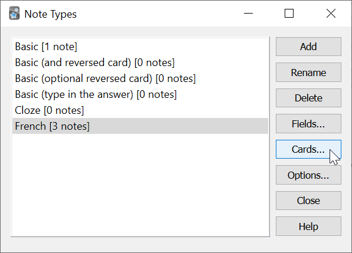

Điền chỗ trống trên văn bản (Dạng *đục lỗ* - Cloze):

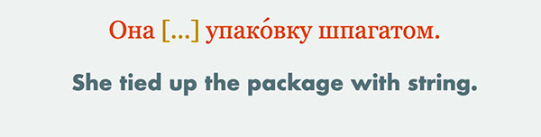

Dạng *Che vùng ảnh* (Image Occlusion):

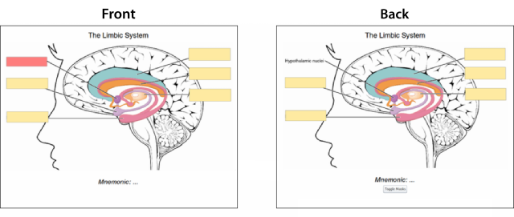

Để tạo thêm loại ghi chú mới hoặc chỉnh sửa các loại ghi chú hiện có, bạn vào **Tools > Manage Note Types** (Công cụ > Quản lý loại ghi chú) trên thanh bảng chọn chính của Anki.

Các ghi chú (Notes) và loại ghi chú (Note Types) được dùng chung cho toàn bộ kho dữ liệu của bạn chứ không bị giới hạn trong từng bộ thẻ (deck) riêng lẻ. Điều này có nghĩa là bạn có thể sử dụng nhiều loại ghi chú khác nhau trong cùng một bộ thẻ, hoặc chia các thẻ được tạo ra từ cùng một ghi chú vào các bộ thẻ khác nhau. Khi thêm ghi chú mới qua cửa sổ **Add**, bạn có thể chọn loại ghi chú và bộ thẻ mong muốn một cách hoàn toàn độc lập với nhau. Bạn cũng có thể thay đổi loại ghi chú của các thẻ đã tạo bất cứ lúc nào trong trình duyệt thẻ (Browser).

### Bộ sưu tập dữ liệu (Collection)

**Bộ sưu tập (_collection_)** là toàn bộ dữ liệu được lưu trữ trong tài khoản Anki của bạn: bao gồm tất cả các thẻ (cards), ghi chú (notes), bộ thẻ (decks), loại ghi chú (note types), các tùy chỉnh bộ thẻ (deck options), cùng các tệp đa phương tiện đi kèm.

## Bộ thẻ chia sẻ cộng đồng (Shared Decks)

Cách nhanh nhất để bắt đầu làm quen với Anki là tải về một bộ thẻ do người khác trong cộng đồng đã tạo và chia sẻ:

1. Nhấp vào nút **Get Shared** (Tải bộ thẻ chia sẻ) ở phía dưới cùng của danh sách bộ thẻ trên màn hình chính.
2. Khi tìm thấy bộ thẻ bạn cần trên trang web AnkiWeb, nhấp vào nút **Download** để tải về tệp gói bộ thẻ (thường có đuôi `.apkg`).
3. Nhấp đúp chuột vào tệp vừa tải về để nhập vào Anki, hoặc trên Anki vào **File > Import** (Tệp > Nhập).

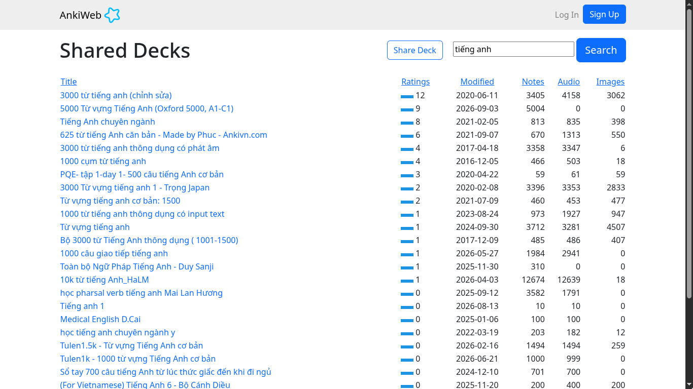

### Lưu ý quan trọng khi dùng Shared Decks

**Tự tạo bộ thẻ cho riêng mình luôn là cách hiệu quả nhất để học một môn học phức tạp.** Các môn học như ngoại ngữ hay khoa học tự nhiên không thể nắm vững chỉ bằng cách học vẹt các mảnh sự thật rời rạc — bạn cần có sự giải thích và bối cảnh (context) thì việc học mới thực sự hiệu quả. Hơn thế nữa, quá trình tự tay chắt lọc và nhập dữ liệu sẽ buộc não bộ của bạn phải suy nghĩ xem đâu là điểm mấu chốt, từ đó giúp bạn hiểu sâu bản chất vấn đề hơn.

Nếu bạn đang học ngoại ngữ, bạn có thể sẽ rất muốn tải về một danh sách dài hàng ngàn từ vựng kèm nghĩa dịch sẵn. Tuy nhiên, việc này sẽ không thể giúp bạn thành thạo ngôn ngữ, cũng tương tự như việc học thuộc lòng các phương trình vật lý không thể biến bạn thành một nhà vật lý thiên văn. Để học đúng cách, bạn cần kết hợp giáo trình, giảng viên hoặc tiếp xúc với các câu văn hoàn chỉnh trong ngữ cảnh thực tế.

> _"Đừng học những gì bạn chưa hiểu."_  
> — **SuperMemo**

Hầu hết các bộ thẻ chia sẻ trên mạng đều do những người đang tự học từ nguồn tài liệu bên ngoài tạo ra (từ sách giáo khoa, bài giảng trên lớp, phim ảnh, v.v.). Họ chỉ chọn lọc những điểm mà bản thân họ thấy thú vị hoặc cần nhớ rồi đưa vào Anki. Họ thường không tốn công ghi thêm thông tin nền hay giải thích chi tiết vào thẻ vì bản thân họ đã hiểu rõ bối cảnh đó rồi. Do đó, khi người khác tải bộ thẻ này về dùng, họ sẽ cảm thấy vô cùng khó hiểu và nhanh nản vì thiếu đi các kiến thức nền và phần giải thích ngữ cảnh.

Điều này không có nghĩa là các bộ thẻ chia sẻ cộng đồng hoàn toàn vô dụng. Nếu bạn đang học theo cuốn giáo trình "ABC" nào đó và có người đã làm sẵn bộ thẻ tóm tắt các ý chính bám sát cuốn "ABC" đó, việc tải về dùng sẽ giúp bạn tiết kiệm được rất nhiều thời gian. Ngoài ra, đối với các môn học đơn giản chỉ bao gồm danh sách các sự kiện thuần túy (như tên các thủ đô, nhận biết quốc kỳ các nước), bạn hoàn toàn có thể học tốt mà không cần thêm tài liệu bên ngoài. Tuy nhiên, đối với các môn học phức tạp, **các bộ thẻ chia sẻ chỉ nên được dùng như một công cụ *bổ trợ* cho tài liệu học chính của bạn, chứ không thể *thay thế hoàn toàn* được.**

## Thông tin khác

Bạn có thể học khóa [Anki cơ bản](https://hocanki.com/ii-anki-co-ban/020-anki-co-ban/) (Không biết có phải được làm bởi AnkiVN không, nhưng có khá nhiều bài hướng dẫn miễn phí nên mọi người có thể học). Hoặc sử dụng các nguồn tài nguyên ở bên dưới đây:

### Cài đặt Anki cho các nền tảng khác (MacOS, Linux, Android, iOS)

- [Hướng dẫn học tiếng Anh qua Flashcard trên AnkiDroid chi tiết](https://www.thegioididong.com/game-app/huong-dan-hoc-tieng-anh-qua-flashcard-tren-ankidroid-chi-tiet-1378805)

### Video

- [Một video hướng dẫn nhanh cách sử dụng, học, thêm thẻ và tối ưu quá trình học trong Anki](https://www.youtube.com/watch?v=Om_1NECh8sQ) - Video nhà làm
- [Video hướng dẫn của Đat Nguyễn trên Youtube](https://youtu.be/M9-qwsHyBrc)

### Tham khảo

Danh sách bài viết được tham khảo từ nhiều nguồn khác nhau:

- [Cách mình học 500 từ mỗi ngày và tăng từ 7+ lên 9+ điểm thi tiếng anh THPTQG trong khoảng 2 tháng](https://spiderum.com/bai-dang/Cach-minh-hoc-500-tu-moi-ngay-va-tang-tu-7-len-9-diem-thi-tieng-anh-THPTQG-trong-khoang-2-thang-k8Pd390eNrS3)
- [Cảm nhận sử dụng của một người dùng trên Spiderum](https://spiderum.com/bai-dang/Tron-1-nam-su-dung-Anki-de-nho-moi-thu-va-mot-so-ghi-chu-8pz)
- [Guide to Anki](https://docs.google.com/document/d/1HiO1Fm3RLOmZiL0tsTXndY4TmzMiZFMQeENx5uCXVE0/edit?tab=t.0#heading=h.gjdgxs)
- [Senrigan - Blog](http://web.archive.org/web/20240324210344/https://senrigan.io/blog/)
- [Studying - Anki Manual](https://docs.ankiweb.net/studying.html)
- [How to learn with Anki](https://a-tiny-improvement.notion.site/How-to-learn-with-Anki-8ce072133ae24b4b9d64c84a7f20b796)
- [Anki Docs](https://docs.ankiweb.net/getting-started.html)
