# Hướng dẫn đào câu trên Netflix và Youtube bằng asbplayer

!!! info "Nguồn hướng dẫn"
Bài hướng dẫn sau đây được dịch bởi Sugor từ [Ngoại ngữ phim và game](http://discord.gg/VW2sAuY). Hướng dẫn gốc bằng Tiếng Anh: [Sentence mining from Netflix and YouTube with asbplayer](https://soyuz18.notion.site/Sentence-mining-from-Netflix-and-YouTube-with-asbplayer-83a03590cd8349ba81ca10340645b565).

    Mình đã cập nhật lại một số thông tin hướng dẫn cài đặt.

### Tổng quan

Asbplayer là một tiện ích trình duyệt và trang web mã nguồn mở, nó giúp chúng ta có thể đào câu một cách dễ dàng từ file video hoặc các trang streaming trực tiếp như Netflix hay Youtube,\... Bản hướng dẫn này sẽ hướng dẫn mọi người cách cài đặt và sử dụng nó với Netflix (kèm theo vài tips cho Youtube).

Mình sẽ mặc định là mọi người đã biết đào câu và dùng Anki (ví dụ: đào câu với Yomichan), và có note type bạn chuyên dùng để đào rồi nhé.

### Cài đặt tiện ích

Hiện tại bạn có thể cài Asbplayer trên Chrome cũng như Firefox (Tính đến hiện tại ngày 09/02 thì bản Firefox vẫn còn thiếu khá nhiều chức năng):

[Tải trên các trình duyệt dựa trên Chrome kiểu như Chrome, Brave, Microsoft Edge (Chrome Web Store)](https://chromewebstore.google.com/detail/asbplayer-language-learni/hkledmpjpaehamkiehglnbelcpdflcab)

[Tải trên Firefox, Librewolf .etc.](https://addons.mozilla.org/en-US/firefox/addon/asbplayer-learn-with-subs/)

Bạn cũng có thể [tải trên Github](https://github.com/killergerbah/asbplayer/releases/), truy cập trang rồi kéo xuống dưới tìm chữ Assets, nó sẽ trông như thế này:

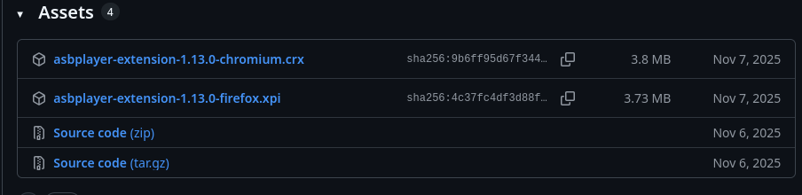

Bạn hãy nhìn 3 chữ cái cuối ở cái tên (hay đúng thuật ngữ hơn thì gọi là _filename extension_), nếu là `.crx` thì là tệp để cài đặt trên Chrome, còn `.xpi` thì để cài đặt trên Firefox (Bấm vào là nó tự cài trên trình duyệt đó, nhưng mà mình gợi ý mọi người cài trên cửa hàng tiện ích cho đỡ mệt :smile:).

Cài xong rồi thì ghim tiện ích lên thanh công cụ để sử dụng dễ dàng hơn:

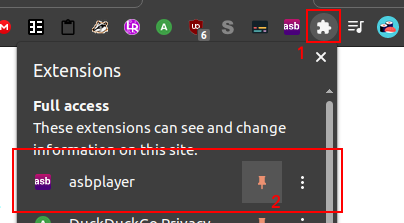{: style="display: block; margin: 0 auto; max-width:70%; height:auto;" }

Sau khi ghim xong, bạn có thể bấm vào icon để xem các cài đặt, nhưng chúng ta không cần chỉnh cái gì cả.

### Kết nối với Anki.

Một khi xong, bạn phải cài [AnkiConnect](https://ankiweb.net/shared/info/2055492159&sa=D&source=editors&ust=1770613297076774&usg=AOvVaw0TpDyI20ZkTEmAYNhN28qg)  và chạy Anki song song.

Mở web asbplayer lên: [https://killergerbah.github.io/asbplayer/](https://killergerbah.github.io/asbplayer/&sa=D&source=editors&ust=1770613297076968&usg=AOvVaw3XTR2tAeJrP9YBTSSNMmLp)

Lúc này web sẽ kết nối với Anki qua AnkConnect, nó sẽ mở hộp thoại như hình dưới. Bấm Yes để cho web quyền dùng AnkiConnect.

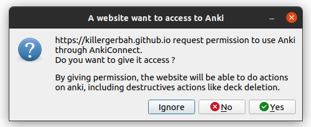{: style="display: block; margin: 0 auto; max-width:70%; height:auto;" }

### Cài đặt note

Trở lại web của [asbplayer](https://killergerbah.github.io/asbplayer/&sa=D&source=editors&ust=1770613297077410&usg=AOvVaw3AmjivDSybMxcjNW1QsqyT) và bấm nút răng cưa ở đầu bên phải màn hình. Một hộp thoại sẽ được mở lên:

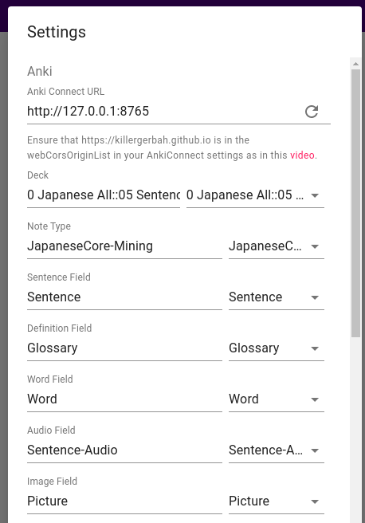{: style="display: block; margin: 0 auto; max-width:70%; height:auto;" }

Ở phần **Deck**, bạn chọn deck tương ứng, các phần còn lại bạn chọn theo note type của mình là được, bấm vào mũi tên ngược để chọn.

### Đào từ Netflix

Cài đặt [Subadub](https://chrome.google.com/webstore/detail/subadub/jamiekdimmhnnemaaimmdahnahfmfdfk&sa=D&source=editors&ust=1770613297078023&usg=AOvVaw3ggMY3pld91p07hXJsNXbV) để tải sub từ Netflix về.

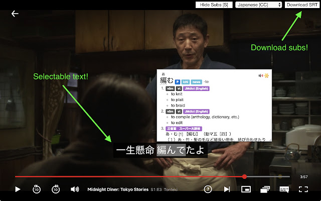

Nếu bạn chưa thấy thì hãy tải lại trang Netflix, sau đó nó sẽ hiện lên như hình trên.

#### LƯU Ý:

Nếu bạn cài nhiều tiện ích hiện sub như absplayer, Subadub và Language Reactor thì nó sẽ thành như dưới hình, rất lộn xộn. Vậy nên hãy chỉ để 1 sub thôi.

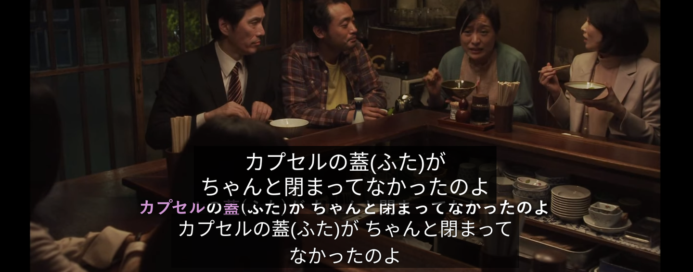

Tải sub lên

1\. Mở trang asbplayer ở 1 tab, Netflix ở một tab.

2\. Bắt đầu mở 1 phim hoặc tập trên Netflix.

3\. Tải sub SRT bằng Subadub bằng cách bấm **Download SRT** ở đầu bên phải của trang.

4\. Kéo file sub vào video.

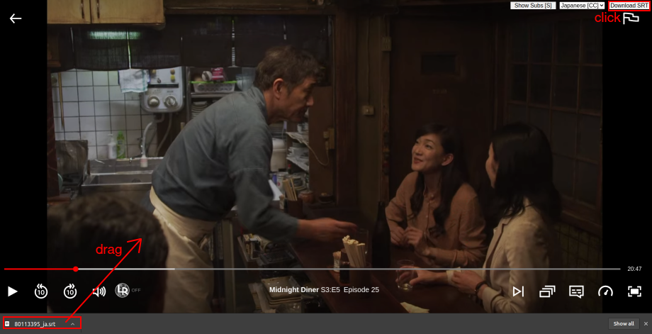

5\. Asbplayer sẽ nhận sub và đồng bộ nó luôn ở trang asbplayer.

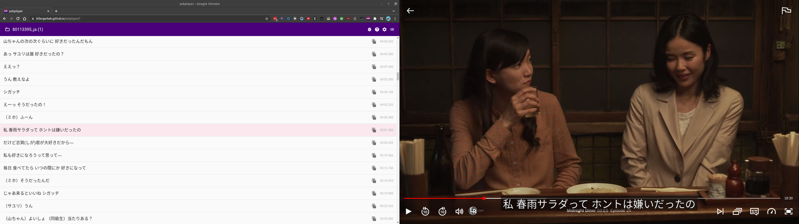

Khi để video chạy ở Netflix thì sub ở trang asbplayer cũng sẽ chạy theo. Bấm vào sub ở trang asbplayer cũng sẽ khiến Netflix nhảy tới phân đoạn tương ứng của sub. Bạn có thể dùng [Yomitan](https://yomitan.wiki/)  để tra từ ở trên trang của asbplayer hoặc ở ngay trên sub luôn cũng được.

### Đào với phím tắt

Khi đang xem video, bạn có thể dùng 1 trong 2 phím tắt này để đào câu với tiếng và hình ảnh::

- ++ctrl++ + ++shift++ + ++z++: Để lưu sub, hình ảnh và tiếng vào web của asbplayer, để xuất sang Anki sau, đây được gọi là cách đào không đồng bộ.
- ++ctrl++ + ++shift++ + ++x++: Để mở hộp thoại xuất qua Anki ngay lập tức, đây gọi là cách đào câu đồng bộ.

LƯU Ý: Khi dùng cách đào không đồng bộ thì bạn xem phim đỡ bị gián đoạn hơn nhưng với cách đồng bộ thì bạn có thể điều chỉnh để có thể đào cả câu sub sau và trước (với những sub bị ngắt quãng ra nhiều dòng, rất hay xảy ra trên Netflix).

### Đào đồng bộ với Ctrl-shift-X

Khi bạn muốn đào câu sub nào, chỉ cần bấm ++ctrl++ + ++shift++ + ++x++ để tiện ích screenshot và lưu tiếng, sau đó sẽ hiện lên hộp thoại như sau:

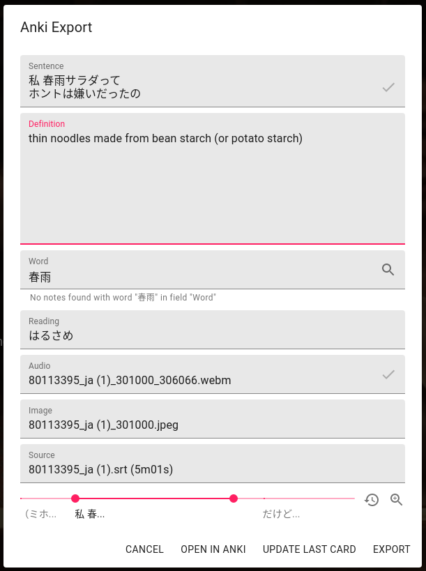{: style="display: block; margin: 0 auto; max-width:70%; height:auto;" }

Từ đây thì bạn có thể điền từ và định nghĩa vào ô '**Word**' và ô '**Definition**' (dùng Yomichan để tra từ'). Kiểm tra tiếng và hình ảnh được cap bằng cách bấm vào các ô tương tự.

Nếu bạn muốn lưu ảnh và tiếng của những câu sub liền nhau, bị xuống dòng thì hãy kéo thanh slide (màu hòng) và bấm vào hai dấu tích để nó đồng bộ thêm. Bạn chỉ có thể làm thế này ở cách đào câu đồng bộ.

Cuối cùng bấm nút EXPORT để tạo card Anki ngay, hoặc bấm OPEN in Anki để mở hộp thoại tạo thẻ Anki (bạn có thể thêm gì bạn muốn).

### Đào câu không đồng bộ với Ctrl-shift-Z

Khi bạn muốn đào câu nào thì bấm ++ctrl++ + ++shift++ + ++z++ để cap ảnh và tiếng, thay vì mở hộp thoại Anki thì video nó sẽ chạy tiếp.

Câu sub sẽ được lưu vào Copy History mà bạn có thể truy cập cách bấm vào icon 3 gạch như ảnh dưới.

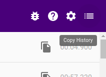{: style="display: block; margin: 0 auto; max-width:50%; height:auto;" }

Bấm vào nút thì sẽ đó nó sẽ hiển thị ra những câu sub đã được lưu. Bấm vào dấu ngôi sao bên cạnh chúng thì hộp thoại Anki sẽ được mở ra.

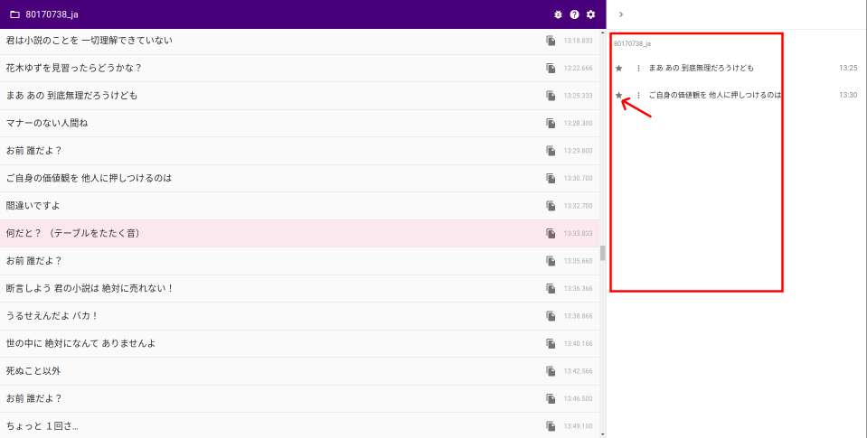

Như cách đào câu đồng bộ, bạn có thể điền định nghĩa và các ô khác như trong hình, bấm **OPEN IN ANKI** hoặc **EXPORT** như mình đã hướng dẫn.

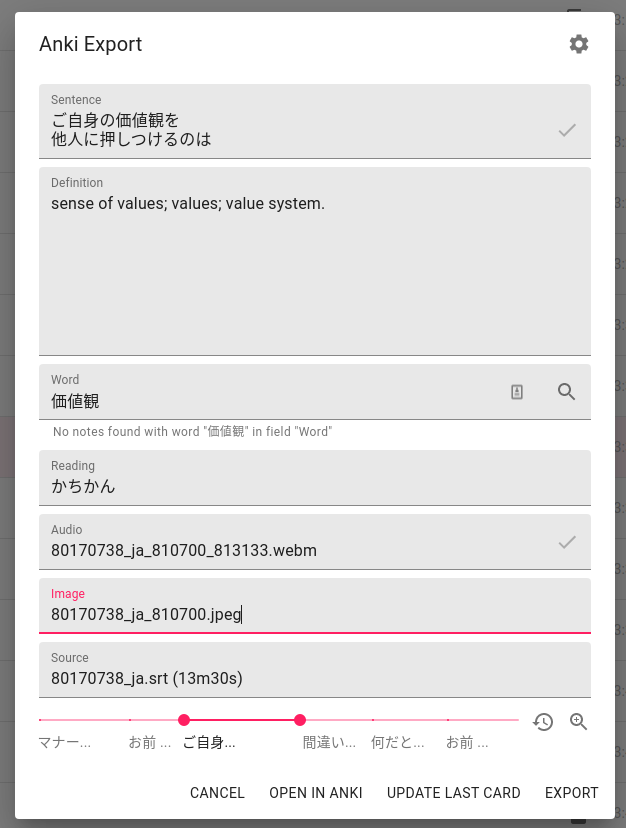{: style="display: block; margin: 0 auto; max-width:70%; height:auto;" }

### Đào từ Youtube

Bạn có thể đào từ Youtube cũng bằng những cách như trên. Nhưng trên Youtube thì đa phần video sẽ chỉ sub bằng máy, và nó rất hay lỗi. Bạn có thể sửa lỗi của những sub bằng máy trong khi hộp thoại Anki được mở lên.

Để tải sub, bạn có thể dùng [YouTube™ dual subtitles](https://chrome.google.com/webstore/detail/youtube-dual-subtitles/hkbdddpiemdeibjoknnofflfgbgnebcm). Một khi cài xong, nút răng cưa trên thanh video Youtube sẽ có thêm những cài đặt, một trong số đó là tải sub về. Và như trước đó, kéo sub được tải vào thanh video để đồng bộ nó với asbplayer được mở ở 1 tab khác.

Cũng như hướng dẫn trên, hai phím tắt ++ctrl++ + ++shift++ + ++x++ và ++ctrl++ + ++shift++ + ++z++ sẽ giúp bạn cap ảnh và tiếng cho câu sub bạn cần.

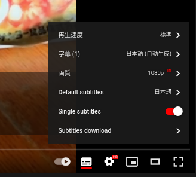{: style="display: block; margin: 0 auto; max-width:70%; height:auto;" }

### Đào từ các trang streaming khác

Chúng ta cũng làm tương tự như cách trên, chỉ khác là tải sub sẽ vất vả hơn 1 chút. Bạn phải tìm và tải sub riêng.

Để tải sub thì [kitsunekko](https://kitsunekko.net/)  là một trang tốt. Bạn có thể tìm sub từ các tập riêng hoặc một zip file cho cả series hoặc mùa. Sau khi tải file zip thì bạn sẽ giải nén nó và chọn những tập riêng để đào.

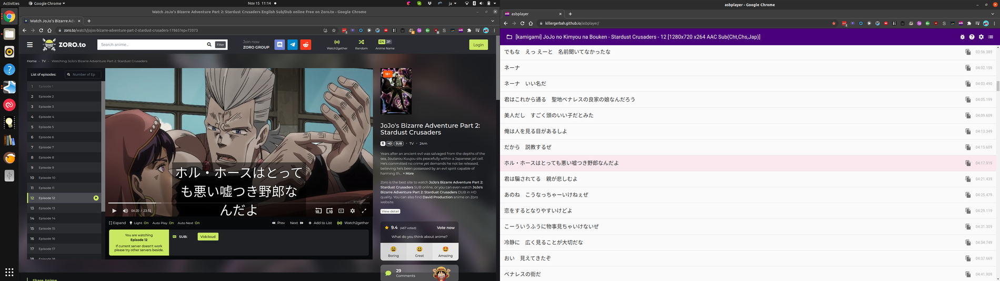

Như trên Youtube hoặc Netflix, bạn nên có [asbplayer page](https://killergerbah.github.io/asbplayer/&sa=D&source=editors&ust=1770613297084221&usg=AOvVaw3PlpJXI-CKSKT9Sp4IH-Td)  mở ở 1 tab riêng, và trang streaming mở nữa.

Kéo sub vào trình chạy video, nó cũng sẽ đồng bộ với asbplayer.

++ctrl++ + ++shift++ + ++x++ và ++ctrl++ + ++shift++ + ++z++ cũng sẽ hoạt đồng tương tự.

### Đồng bộ sub với video

Nếu bạn đang xem phim trên các trang streaming khác ngoài Netflix hoặc Youtube thì sau khi tải những sub trên các trang như [kitsunekko](https://kitsunekko.net/&sa=D&source=editors&ust=1770613297084869&usg=AOvVaw1TrZAUoBjc1Kew5Ptffa3m)  về thì sẽ có khả năng file sub và video sẽ không đồng bộ. Nếu bạn muốn nó chạy khớp thì bạn có thể đúng Ctrl- Trái/Phải hoặc Shift-Trái/Phải để chỉnh sub thành câu tiếp theo hoặc câu phía trước trong khi video vẫn đang chạy bình thường.

Dùng Ctrl-Shift-Trái/Phải để chỉnh lên +/-100ms.

### Các vấn đề thường gặp

#### Viền đen xung quanh ảnh

Với Youtube thì hình ảnh sẽ thường không được cắt đúng. Sẽ có viền đen xung quanh ảnh.

Điều này sẽ xảy ra thường xuyên với các web streaming khác. Bạn có thể mở full màn video để sửa lỗi này.

#### Amazon Video

Nếu bạn kéo file sub vào mà asbplayer mở nhưng không hiện sub thì hãy chỉnh trình chạy video thành full màn trước khi kéo file sub để sửa lỗi này.

#### Lỗi Failed to fetch

Một số trình duyệt hoặc tiện ích có thể chặn tín hiệu HTTP tới máy tính bạn vì vấn đề bảo mật. Tắt tính năng này nếu bạn gặp phải lỗi trên.

- Trình duyệt Brave - [tắt tính năng shield](https://support.brave.com/hc/en-us/articles/360023646212-How-do-I-configure-global-and-site-specific-Shields-settings-&sa=D&source=editors&ust=1770613297086452&usg=AOvVaw1G0ansU-Sy8fdBdjQ3MBna)

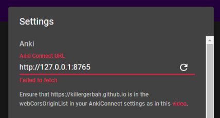{: style="display: block; margin: 0 auto; max-width:60%; height:auto;" }
