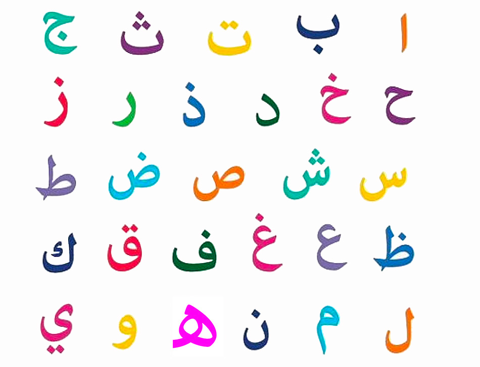

# Tự học Tiếng Ả Rập

Một hướng dẫn tự học Tiếng Ả Rập chưa hoàn chỉnh.

!!! info "Lưu ý"
    Lộ trình & phương pháp tự học đã được đề cập ở [Hướng dẫn tự học ngoại ngữ](../../guide.md). Bạn nên đọc hướng dẫn tự học trước khi bắt đầu.

## Giới thiệu

Học tiếng Ả Rập để xem phim, nói chuyện với người bản xứ, hay đọc báo chí và tiểu thuyết đều đòi hỏi những kỹ năng nền tảng giống nhau. Hướng dẫn này được viết để giúp bạn tự xây dựng nền tảng và học lên cao hơn.

## Bảng chữ cái

Đầu tiên, bạn cần học từng chữ cái cơ bản. **Bảng chữ cái Ả Rập** có 28 chữ cái, tất cả đều đại diện cho các phụ âm và được viết từ phải sang trái. Mỗi chữ có 4 hình dạng khác nhau tùy vị trí (đầu, giữa, cuối, hoặc đứng riêng). Nghe có vẻ phức tạp, nhưng thật ra chỉ như cách chữ cái trong tiếng Latinh thay đổi viết hoa, viết thường.

Bạn không cần học viết tay đẹp ngay. Thay vào đó, hãy tập **nhận diện và đọc**. Hãy chú ý đến nguyên âm ngắn (dấu tashkīl). Trong sách học hoặc truyện thiếu nhi, tashkīl sẽ giúp bạn đọc chính xác. Sau này, trong văn bản thật, dấu thường bị lược bỏ, nhưng nền tảng này giúp bạn đoán đúng cách phát âm.

## Học Tiếng Ả Rập

### Ngữ pháp

Ngữ pháp Ả Rập nghe đáng sợ, nhưng bạn không cần phải *làm chủ* nó từ đầu. Hãy chọn một hướng dẫn ngữ pháp và đọc từ đầu đến cuối, không bỏ sót, chỉ để làm quen. Bạn sẽ không nhớ hết, nhưng bạn sẽ biết cấu trúc đó tồn tại để sau này nhận diện.

Một lựa chọn ngắn gọn và hiệu quả là **“All The Arabic You Never Learned The First Time Around”** (MSA). Ngoài ra, bộ sách **Al-‘Arabiyyah Bayna Yadayk** cũng phổ biến cho người mới. Đọc toàn bộ guide một lần, rồi khi gặp khó khăn trong input, quay lại tham khảo. Học ngữ pháp không biến bạn thành người giỏi tiếng Ả Rập, nhưng nó cho bạn một bản đồ.

### Từ vựng

Vốn từ vựng mới là chìa khóa để đọc và nghe. Cách hiệu quả nhất là dùng **Anki**, một chương trình flashcard theo spaced repetition. Bắt đầu với một deck có sẵn, ví dụ **“Top 5000 Arabic Words”** (MSA) hoặc **Refold Core MSA Deck**. Học khoảng 1000–2000 từ cơ bản sẽ giúp trải nghiệm tiêu thụ ngôn ngữ bớt *bỡ ngỡ*.

Khi đã quen, bạn sẽ tạo **mining deck** riêng: khi đọc/xem, gặp từ chưa biết, tra nghĩa, rồi thêm vào Anki. Đây là vòng lặp bất tận: **Input → Mining → Anki → Input**. Đó là cách vốn từ của bạn bùng nổ.

## Vậy tóm lại là học như thế nào?

1. **Học bảng chữ cái**: tập đọc và nhận diện chữ. Làm quen tashkīl để phát âm chính xác. Không cần viết tay đẹp.
2. **Bắt đầu một frequency deck**: dùng Anki với “Top 5000 Arabic Words” hoặc “Refold Core MSA Deck”. Giữ nhịp 10–20 từ mới/ngày.
3. **Chọn một hướng dẫn ngữ pháp** (ví dụ “All The Arabic You Never Learned The First Time Around”). Đọc toàn bộ một lần, sau này quay lại tra cứu.
4. **Song song học vocab + ngữ pháp**. Đừng vội. Điều quan trọng là duy trì đều đặn.
5. Khi đã có khoảng 1000–2000 từ và đã đọc xong 1 hướng dẫn ngữ pháp, hãy **bắt đầu input dễ hiểu**: truyện thiếu nhi, hoạt hình lồng tiếng MSA có phụ đề, podcast beginner.
6. **Tạo mining deck**: khi gặp từ/cụm mới trong content, tra và add vào Anki.
7. **Đọc/nghe nhiều hơn**. Ban đầu chậm, nhưng càng tiếp xúc, tốc độ hiểu càng tăng.
8. **Tiếp tục vòng lặp**: Input → Mining → Anki → Input.
9. Khi thấy thoải mái với MSA, bạn có thể mở rộng sang dialect (Ai Cập, Levantine, v.v.) tùy mục tiêu giao tiếp.
10. Quan trọng nhất: hãy chọn content bạn thấy thú vị, để có thể duy trì lâu dài.

