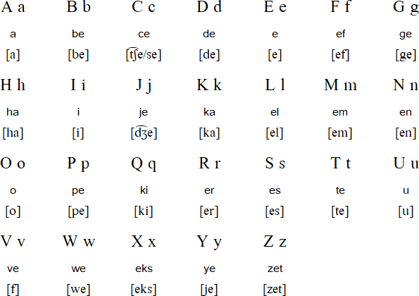

# Tự học Tiếng Indonesia

Một hướng dẫn tự học tiếng Indonesia.

!!! info "Lưu ý"
    Lộ trình & phương pháp tự học đã được đề cập ở [Hướng dẫn tự học ngoại ngữ](../../guide.md). Bạn nên đọc hướng dẫn tự học trước khi bắt đầu.

## Giới thiệu

Để có thể giao tiếp với người bản xứ Indonesia, xem phim mà không cần phụ đề, hay đọc tiểu thuyết, báo chí và các tài liệu khác bằng tiếng Indonesia, bạn cần nắm được những kỹ năng cơ bản giống nhau: khả năng đọc, khả năng nghe và vốn từ vựng. Hướng dẫn này không phải là một giáo trình đầy đủ để bạn thành thạo ngôn ngữ, nhưng nó sẽ cung cấp cho bạn một lộ trình thực tế để bắt đầu. Tinh thần chung của phương pháp này vẫn dựa vào ba trụ cột chính: immerse trong ngôn ngữ (immersion), sử dụng Anki (SRS) để ghi nhớ, và khai thác (mining) từ vựng trực tiếp từ những tài liệu bạn đọc và nghe trong quá trình học.

### Hệ thống chữ viết

Tiếng Indonesia sử dụng bảng chữ cái Latin, vì vậy bạn không phải học một hệ thống ký tự hoàn toàn mới. Điều này giúp việc tiếp cận ngôn ngữ dễ dàng hơn, nhưng vẫn có một số điểm cần chú ý.

Chính tả tiếng Indonesia nhìn chung phản ánh âm thanh khá chính xác: hầu hết các từ viết thế nào thì đọc như vậy. Tuy nhiên, bạn cần làm quen với một số âm không có trong tiếng Việt hoặc tiếng Anh, chẳng hạn như “ngg”, “sy” hay “kh”. Tốt nhất là bạn nên nghe người bản xứ nói, bắt chước cách phát âm, ngữ điệu và trọng âm để hình thành thói quen đúng ngay từ đầu.

Ngoài ra, tiếng Indonesia chứa rất nhiều từ mượn từ các ngôn ngữ khác như Hà Lan, Ả Rập, Bồ Đào Nha, tiếng Java và cả tiếng Anh. Bạn sẽ sớm nhận ra sự tồn tại song song của hai dạng ngôn ngữ: Bahasa Indonesia chuẩn (dùng trong văn bản chính thức, báo chí, các tài liệu nhà nước) và bahasa gaul, tức ngôn ngữ đời thường, tiếng lóng mà người dân dùng trong giao tiếp hằng ngày, trên mạng xã hội hay trong phim ảnh. Để sử dụng ngôn ngữ thành thạo, bạn nên làm quen cả hai dạng này.

Về chữ viết, việc học tập trung chủ yếu vào chính tả chuẩn Ejaan yang Disempurnakan (EYD) và sự khác biệt giữa ngôn ngữ chuẩn và ngôn ngữ đời thường. Ví dụ, “tidak” là cách nói chuẩn của “không”, trong khi “nggak” lại phổ biến hơn trong giao tiếp đời thường. Việc nhận ra và sử dụng linh hoạt những biến thể này là rất quan trọng. Đồng thời, bạn cũng nên chú ý đến các từ mượn để không bị bỡ ngỡ, chẳng hạn như “kantor” (văn phòng, từ tiếng Hà Lan) hay “kursi” (ghế, từ tiếng Ả Rập).

## Ngữ pháp

Về mặt ngữ pháp, tiếng Indonesia được xem là một trong những ngôn ngữ khá đơn giản. Không có sự chia thì như trong tiếng Anh, thay vào đó người ta chỉ sử dụng trạng từ chỉ thời gian. Ngôn ngữ này cũng không có giống hay giới tính ngữ pháp. Tuy nhiên, hệ thống tiền tố và hậu tố (affixes) lại cực kỳ quan trọng vì nó quyết định sắc thái nghĩa của từ và câu.

Cách học hiệu quả nhất là chọn một giáo trình và đọc xuyên suốt từ đầu đến cuối. Một số tài liệu phù hợp cho người mới gồm *Indonesian Grammar in Context* của Eirlys Davies và Abdullah Hassan, *Colloquial Indonesian* của Sutanto Atmosumarto, hoặc các nguồn miễn phí trực tuyến như SEAsite Indonesian Grammar.

Mục tiêu khi đọc các tài liệu này không phải là ghi nhớ tất cả ngay lập tức, mà là làm quen với cấu trúc ngữ pháp cơ bản, sau đó củng cố lại thông qua việc đọc và nghe thực tế.

## Từ vựng

Vốn từ vựng là nền tảng để bạn tiến xa hơn. Bạn có thể sử dụng Anki để ghi nhớ thông qua hệ thống lặp lại ngắt quãng (SRS). Bạn nên bắt đầu với các bộ từ vựng cơ bản tiếng Indonesia (khoảng 1000–2000 từ phổ biến).

Khi đã có một nền tảng nhất định, bạn có thể chuyển sang mining deck, tức là tự tạo bộ từ vựng của riêng mình bằng cách thêm những từ mới gặp khi đọc truyện, xem phim, hay lướt mạng xã hội. Mỗi khi gặp một từ mới, bạn chỉ cần tra nghĩa và đưa ngay vào Anki để luyện tập.

## Vậy thì cần làm gì để học tiếng Indonesia

1. Bắt đầu làm quen với phát âm và chính tả tiếng Indonesia. Nghe và lặp lại để nắm trọng âm và ngữ điệu.
2. Chọn một grammar guide (*Colloquial Indonesian* hoặc *Indonesian Grammar in Context*) và đọc từ đầu đến cuối.
3. Song song, bắt đầu với một deck Anki cơ bản (~1000–2000 từ).
4. Sau khi có vốn từ nền, bắt đầu đọc truyện, báo, hoặc xem phim, YouTube bằng tiếng Indonesia.
5. Khi gặp từ mới, tra nghĩa và thêm vào mining deck của bạn.
6. Tiếp tục ôn tập bằng Anki mỗi ngày, duy trì immersion càng nhiều càng tốt.
7. Càng đọc/nghe nhiều, bạn càng quen với ngôn ngữ chuẩn và gaul.

