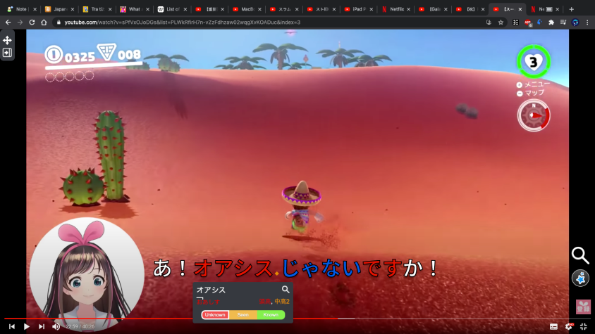

# Giai đoạn 1

Một thứ tiếng sẽ có 5 giai đoạn, mỗi giai đoạn sẽ kéo dài khoảng từ nửa năm tới 1, 2 năm tuỳ người và tuỳ mức độ thời gian mà bạn nạp input. Đây là hướng dẫn để các bạn vượt qua giai đoạn đầu, cũng là giai đoạn khó khăn nhất khi học thứ tiếng đó. Giai đoạn mà mình sẽ gần như không hiểu gì cả, nghe không hiểu gì, đọc không hiểu gì (đối với các nội dung người bản địa làm cho người bản địa tiêu thụ).

### HỌC TIẾNG ANH VÀ CÁC THỨ TIẾNG MÀ BẠN ĐÃ NẮM RÕ BẢNG CHỮ CÁI

Tuy nhiên, học như trên cũng chỉ đủ để lưu bảng chữ cái vào bộ nhớ tạm thời. Muốn thực sự học được chúng, bạn phải:

**ĐỌC DÙ KHÔNG HIỂU GÌ VẪN CỨ ĐỌC**

**NGHE DÙ KHÔNG HIỂU GÌ VẪN CỨ NGHE**

*Thông qua phim ảnh, game, đọc lời nhạc, sách, từ điển đơn ngữ...*

Giải thích cho việc này: Học ngôn ngữ cũng giống như bạn phải ghi nhớ hàng nghìn con người, mỗi người là một từ mới.

Để nhớ được một người, việc đầu tiên là bạn phải gặp họ, nhìn thấy mặt họ. Rồi sau này khi bạn nói chuyện với họ, cảm thấy thích họ, bạn sẽ muốn gặp họ nhiều hơn và dần dần nhớ mặt họ, sau khi nhớ mặt bạn sẽ nhớ thông tin và tên của họ.

Cái mặt người chính là mặt chữ, thông tin là nghĩa của từ và tên là cách đọc từ đó. Nếu ngay từ đầu bạn đã không thích thứ mình đang xem, thì cũng giống như là bạn gặp một người bạn rất ghét, rất chán và chẳng muốn nhớ tới họ làm gì. Bằng cách tạo ra cơ hội gặp thật nhiều cái "người" mà chúng ta thích, chúng ta không cần phải ghi nhớ mà vẫn sẽ cứ nhớ họ. Bằng cách xem các nội dung mà chúng ta thích, chúng ta sẽ học thêm từ mới một cách rất dễ dàng kỳ diệu.

Điều này dẫn chúng ta tới kết luận, sách ngữ pháp có tác dụng, nhưng chỉ duy nhất ở giai đoạn này, càng về sau nó càng vô dụng và làm cho chúng ta rối rắm. Nếu bạn thích ngữ pháp thì cứ học ngữ pháp song song với việc immerse. Nhưng làm bài tập ngữ pháp thì nên hạn chế.

Các nội dung tốt nhất khi mới học:

1. Là các nội dung bạn đã xem rồi và rất thích, thì bạn xem lại dù không hiểu gì nhưng bạn vẫn biết được cốt truyện và đọc kanji, đoán từ...

2. Là các nội dung mới nhưng cực kỳ hay, bạn có thể tắt tiếng đi mà vẫn xem được, xem đi xem lại bao lần cũng không xi nhê
3. Video game, video game được thiết kế để người ta chơi mà không cần phải hiểu quá nhiều
4. Các clip Youtube người bản địa làm cho đối tượng người nước ngoài, hoặc video người không phải bản địa nhưng giỏi ngoại ngữ nói ngoại ngữ (thường có phụ đề, xài ngôn từ đơn giản)

### Chiến lược

Bạn hãy xem một anime mình thích, nghe cũng được mà đọc phụ đề cũng không sao (nên sử dụng Migaku MPV hoặc Migaku để xem). Cứ cố để hiểu đại khái những gì đang xảy ra trong phim, nhưng cái gì khó hiểu quá thì bỏ qua và cứ xem tiếp. Có thể xem cùng lúc 2 phụ đề, đọc phụ đề tiếng đang học trước, không hiểu thì nhìn qua phụ đề dịch. Nếu chỉ xem phụ đề dịch thì coi như là không học.

Trong lúc xem, bạn hãy làm thẻ Anki bằng Migaku với những câu hay từ mới thông dụng mà bạn muốn học.

Mỗi ngày sử dụng Migaku hoặc Migaku MPV để tạo và học khoảng 5 10 15 thẻ Anki mới, sau khi có khoảng 2000 thẻ cộng với thời gian xem phim đọc truyện tương đối, thì bạn sẽ vượt qua giai đoạn này

Ở giai đoạn 1 và giai đoạn 2, chúng ta tập trung hơn vào việc luyện khả năng đọc, để khi tới giai đoạn 3 thì khả năng đọc sẽ được chuyển hoá dần thành khả năng nghe.

Bạn cũng nên fake IP qua quốc gia mà bạn học tiếng với Hola VPN. Hoặc bạn tự thuê một dịch vụ fake IP bất kỳ.

Lưu ý, không nên đọc quá nhiều sách chữ, vì đọc sách chữ mà không nghe cách phát âm, có thể sẽ làm hỏng phát âm của bạn sau này

Lưu ý thứ 2, không được nói + viết (output) trong giai đoạn này.

Lưu ý thứ 3, học ngữ pháp ở giai đoạn này là tốt, nhưng không nên làm bài tập ngữ pháp, chỉ đọc qua sách ngữ pháp để hiểu đại khái. Mình sẽ thực sự hiểu khi đọc truyện xem phim nghe nhạc sau này

### Tại sao phải làm thẻ cho Anki và immerse (nghe + đọc liên tục)?

Một người bản địa trung bình biết khoảng 20000 từ.

Trong 1 năm nếu ngày nào bạn cũng làm 10 thẻ cho Anki thì 1 năm bạn sẽ có 3650 thẻ, 4 năm là 14600 thẻ, tương đương với 14600 từ vựng, cách diễn đạt (ngữ pháp). 4 năm duy trì thì sẽ có những từ bạn biết mà người bản địa chưa chắc họ biết, vì sẽ có nhiều từ khác không cần làm thẻ bạn cũng đã học được. Nếu chỉ làm 5 từ mỗi ngày, thì sau 4 năm bạn cũng có tới 7300 từ và cấu trúc chắc chắn nắm rõ.

Tóm lại, immersion và sentence mining nếu duy trì trong 3 tới 5 năm thì bạn sẽ có lượng từ vựng và trình độ gần như tương đương với một người bản địa.

### Giải thích rõ hơn về lý do và tại sao lại nên học từ vựng bằng sentence mining.

Sentence mining là việc bạn học từ vựng thông qua mẫu câu ví dụ chứa từ đấy. Mục đích của cách làm này là giúp bạn hiểu nghĩa cũng như cách sử dụng của từ đấy. Thông thường thì các bạn hay học từ vựng như thế này:

"Từ bạn đang học" = "nghĩa dịch của từ đó trong ngôn ngữ mẹ đẻ (tiếng Việt)"

- 大胆 = gan dạ
- 気分 = tâm trạng
- 気持ち = tâm trạng
- 感情 = cảm tình
- 待遇 = đối xử
- 扱う = đối xử
- 遊ぶ = chơi
- Đại loại như thế này.

Vấn đề với cách học này là các bạn sẽ không phân biệt đc nghĩa và nuance (sắc thái, nghĩa chi tiết) của từ. Học như vậy sẽ dễ bị lộn và liên tưởng sai => dẫn đến cách dùng từ sai, hiểu sai nghĩa
sentence mining là mình học cách sử dụng của từ đó luôn bằng cách tìm 1 mẫ u câu để biết luôn cách sử dụng từ đó, chưa kể giúp dễ nhớ hơn nữa.

vd bạn muốn học nghĩa của từ 大胆 thì bạn nên học 1 mẫu câu dùng từ ấy như 大胆に発言する
Nếu học từ riêng lẻ vậy sẽ gây ra tình trạng dịch tiếng Việt sang tiếng đó hay chế bậy bạ vì mỗi ngôn ngữ có cách suy nghĩ và quan niệm khác nhau.

VD: tiếng Việt thường nói là "chơi fb, chơi zalo vân vân", bây giờ muốn nói tương tự như vậy trong tiếng Nhật thì phải nói là 「フェースブックをやってるんですか」 chứ đâu ai nói 「フェースブックを遊んでるんですか」. Nói vậy thì có thể người ta hiểu nhưng đó là tiếng Nhật sai, ko đúng. Mà đã sai như vậy thì sau này khó sửa, dễ mắc lỗi sai tiếp. Đây cũng là lý do mà bạn tránh output (nói/viết bằng ngôn ngữ ấy) quá sớm khi còn đang ở trình độ cơ bản. Vì khi ở trình độ cơ bản, kiến thức bạn chưa nhiều, bạn sẽ dễ rơi vào tình huống chế hay nói sai.

Ví dụ như học tiếng Việt vậy, đó giờ mình người bản xứ mình đâu có học từ riêng lẻ đâu, mình học luôn cách sử dụng.

Đâu có ai nói "lòng mẹ mênh mông" mà người ta nói "lòng mẹ bao la", "mênh mông" thì phải là "cánh đồng mênh mông" => qua 2 ví dụ này thì mình có khả năng phân biệt *nuance* và cách dùng của 2 từ này. Tuy là mình có thể không giải thích được nhưng khi muốn phân biệt thì mình nhớ lại 2 mẫu câu ấy để phân biệt. Chứ đâu có ai nhớ như "mênh mông là miêu tả sự rộng lớn diện tích của một bề mặt vân vân" hay "bao la là miêu tả sự rộng lớn của một không gian vân vân" đâu đúng ko? Làm vậy càng rối hơn.

Khi muốn miêu tả bầu trời sao sáng trên trời thì mình biết ngay là phải nói "trời sao lấp lánh" hoặc "trời sao lung linh" . Hay khi muốn miêu tả cơn gió lạnh buổi chiều tối thì thường nói là "gió thổi vù vù"; muốn miêu tả thời tiết cực lạnh thì có thể nói là "cơn lạnh thấu xương". Thì tương tự vậy, khi học từ thì bạn nên học luôn cách sử dụng của từ đó, giúp dễ nhớ hơn và bạn nhớ luôn cách sử dụng. Có những từ có cách dùng có thể nói là được định sẵn rồi, thường chỉ dùng theo cách đó. Vd như 未然 thì phải dùng là 「未然に防ぐ」（事故を未然に防ぐ）。寸暇＝「寸暇を惜しむ」（寸暇を惜しんで勉強する）vân vân

### Nếu tui xem phim/đọc tiểu thuyết mà không hiểu gì thì có sao không?

**Trả lời:** Đó là điều hoàn toàn bình thường. Kỹ năng nghe là kỹ năng khó phát triển nhất vì nó mất nhiều thời gian hơn cả.

Đối với hầu hết người mới bắt đầu, những người chưa biết bất kỳ ngôn ngữ gốc Châu Á hoặc ngôn ngữ dựa trên thanh điệu nào, sẽ mất nhiều tháng để bạn làm quen dần với ngôn ngữ đó. Vì vậy, nếu ngôn ngữ mẹ đẻ của bạn chỉ là tiếng Anh, thì sẽ mất một thời gian ban đầu bạn phải tiêu thụ nội dung ngoại ngữ mà gần như chẳng hiểu gì, trái ngược với những người đã biết tiếng Quan Thoại, Quảng Đông, Hàn Quốc, v.v. (hoặc ngược lại, nếu bạn học tiếng Anh, Pháp, TBN... mà bạn là người Châu Á thì lúc bắt đầu cũng khó tương tự)

Đối với hầu hết mọi người, bước ngoặt đầu tiên dường như rơi vào khoảng 7 đến 10 tháng sau khi áp dụng phương pháp để học, miễn là bạn đã thực hiện việc nghe hàng ngày cả bị động lẫn chủ động, bạn đọc và làm flashcard theo đúng như hướng dẫn trong suốt thời gian đó, thì bước ngoặt này "chắc chắn" sẽ xảy đến. Nó có thể xảy đến trong khoảng chỉ 3 tới 6 tháng nếu như bạn áp dụng nghiêm túc những chia sẻ của cộng đồng này.

Tại thời điểm đó, bạn vẫn sẽ không sử dụng được ngoại ngữ một cách trôi chảy - còn lâu mới tới - nhưng các chương trình phim truyện drama đời thường sẽ không còn là một bức tường của "tiếng ồn khó hiểu" nữa, và bạn sẽ đạt được sự thoải mái khi nghe ngôn ngữ đang học dù hiểu nhiều hay ít. Để rồi một vài tháng sau đó thì bạn sẽ phát triển nhanh như bão táp.

### Làm thế nào để nói viết trôi chảy và dễ dàng như người bản xứ?

Lời giải cho bí mật kinh thiên động địa này hoá ra chỉ nằm ở cái nồi cơm nhà bạn

Khi bạn ăn xong và cơm thừa còn đọng lại ở đáy nồi, bạn cạo, cạo, cạo... gãy cả cái muôi mà cơm cũng không bong ra hết.

Nếu bạn rót nước vào rồi ngâm nồi khoảng 15 phút, việc cạo cơm bỏ đi sẽ dễ hơn một chút, tuy không triệt để nhưng tốt hơn 10 lần việc không có nước.

Ngâm 3 tiếng, bạn có thể cạo gần như hết sạch cơm mà không tốn mấy sức.

Ngâm 10 tiếng, có thể bạn đổ nước đi là cơm cũng tự bong, tự trôi theo.

Việc cơm bong tượng trưng cho khả năng nói và viết của bạn (output). Còn dòng nước tượng trưng cho số lượng và chất lượng của nội dung mà bạn nghe và đọc (input).

Bạn còn tính làm nghệ nhân cạo cơm tới bao giờ nữa?

### Quá trình hấp nạp từ mới và mẫu câu qua phim ảnh, tiểu thuyết (language acquisition) diễn ra thế nào?

Mình có một chiếc máy đọc sách Amazon Kindle (tên hãng) Oasis (tên dòng máy). Sau nhiều năm chìm mình vào nội dung tiếng Anh, mình đã gặp từ Oasis nhiều lần rồi, mình biết chữ Oasis có nghĩa gì đó. Nhưng mình không quan tâm lắm nên không tra xem nó là gì, vì những hoàn cảnh mình gặp từ này đều không phải hoàn cảnh thực tế, thông dụng trong đời sống. Tuy nhiên cái mặt chữ thì mình nắm rất rõ.

Hôm nay đang coi 実況 tiếng Nhật thì có từ オアシス (Oasis) - ảnh bên dưới. Mình thấy Mario đang trong sa mạc, nhưng lại nhìn thấy một đám cây. Mình hiểu ngay rằng, à thì ra Oasis nghĩa là như vậy, là cái vùng có cây cỏ (nước) trên sa mạc cằn cỗi.

Mình tra thử thì quả nhiên: 砂漠の中で、そこだけ水が涌（ワ）き、緑地になっている所 (Trong sa mạc, chỉ có nơi này là có nước, vùng đất có cây xanh.)

_Mình còn không biết Oasis tiếng Việt nghĩa là gì, nhưng bằng immersion mình đã học được nó ở tiếng Anh và tiếng Nhật, cùng một lúc_.

**-> Cứ immerse, gặp từ mới và cấu trúc câu nhiều lần, phối hợp với hiệu ứng hình ảnh và âm thanh, ngữ cảnh... Tự bạn sẽ hiểu ra hết tất cả mọi thứ. Tra cứu và flashcard, tìm hiểu cấu trúc ngữ pháp... chỉ là thứ phụ trợ cho quá trình immerse trở nên nhanh thêm. Cái đưa chúng ta đến đích, luôn luôn là số lượng và chất lượng của input**.

### Lưu ý

Anki chỉ đóng vai trò phụ trợ giúp quá trình học nhanh hơn một chút ở trình độ sơ cấp và trung cấp. Nhưng nếu bạn quá chăm chú vào việc tinh chỉnh, tối ưu Anki thì bạn lại lãng phí thời gian mà quên đi mất điều quan trọng nhất là phải chìm mình vào ngôn ngữ. Vậy nên, bạn hãy xác định đi một trong ba con đường sau:

1. Sử dụng các công cụ tối ưu nhất cho việc làm thẻ có đủ cả hình và tiếng trên Youtube và Netflix như Asbplayer/Migaku/ShareX/Migaku MPV/SubSRS... trong khoảng 2 tới 3 năm và sau đó xoá luôn Anki.
2. Hoàn toàn không sử dụng Anki và tập trung hết thời gian vào việc tiêu thụ nội dung và tra cứu.
3. Tạo thẻ cực kỳ đơn giản bằng chức năng có sẵn của Anki. Chỉ cần một câu văn bất kỳ có một từ bạn muốn học, và nghĩa của từ đó trong từ điển đa ngữ/đơn ngữ (hoặc không có cũng được).

Rất nhiều người trên thế giới học ngoại ngữ thành công mà không cần Anki, và ngay cả tạo Anki bằng cách sơ sài như cách 3, cũng đã có người học lên trình độ cực cao chỉ trong vòng một thời gian rất ngắn, rồi họ cũng xoá Anki. Nên bạn hãy nhớ là, có Anki và Migaku thì tốt, nhưng nếu không có thì bạn vẫn nên tin tưởng vào phương pháp. Bằng mọi giá phải ưu tiên thời lượng và chất lượng của việc chìm mình vào ngôn ngữ đang học!